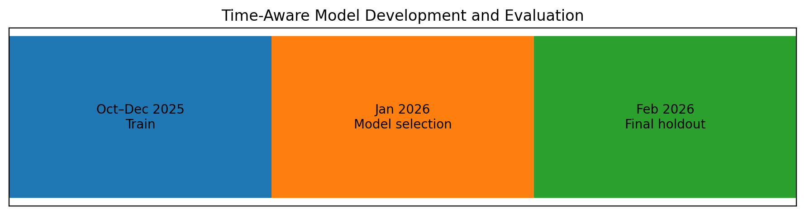
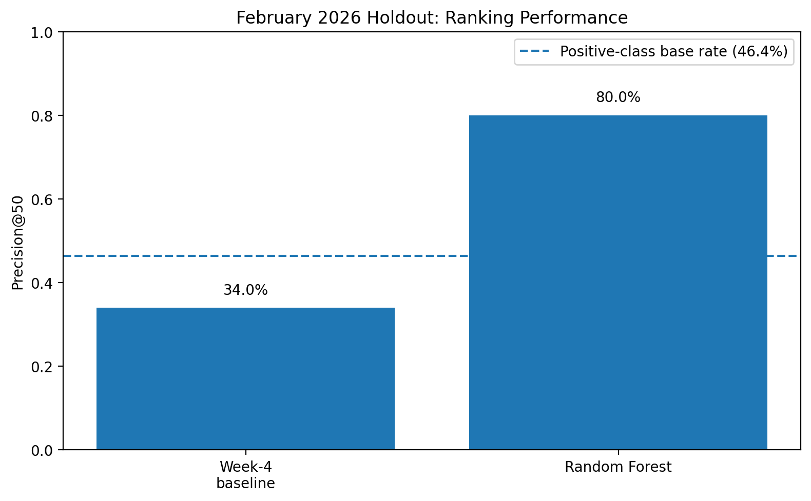

# Prioritizing Content for Editorial Review with Search and Engagement Signals

**Author:** Innocent Chinwendu Uguru  
**Track:** Machine Learning  
**FlyRank ML Internship**  
**Date:** August 2026

---

## Abstract

Which content pages should be prioritized for editorial review based on their search and engagement signals? Using the FlyRank ML Internship dataset, this study compares a position-aware rule-based baseline with a Random Forest ranking model built from five search and engagement features. The model uses a time-aware validation design, with October–December 2025 for training, January 2026 for model selection, and February 2026 reserved as the final holdout. On the February 2026 holdout, the Random Forest achieved 0.80 Precision@50 compared with 0.34 for the Week-4 rule-based baseline, against a positive-class base rate of 46.4%. The resulting ranking is intended as decision support for editors who need to prioritize limited review capacity, rather than as an automated verdict that a page should be refreshed.

---

## 1. Introduction / Problem Statement

Content teams may manage large numbers of pages while having limited time to review them. A practical problem is therefore not simply identifying pages with poor performance, but deciding which pages deserve attention first.

This project investigates the following research question:

> **Which content pages should be prioritized for review based on their search and engagement signals?**

The intended decision is a ranked review queue. The system produces a score for each candidate page and ranks pages from higher to lower priority. Editors can then review the highest-ranked candidates first.

The system is deliberately designed as decision support rather than automated editorial decision-making. A high model score does not mean that a page must be refreshed. It indicates that the page is relatively high in the model's ranking and may deserve human attention.

This framing also determines how the model is evaluated. Because the practical workflow involves reviewing a limited number of pages, the main evaluation metric is **Precision@50**: the proportion of the 50 highest-ranked candidates whose future outcome matches the study's positive target.

---

## 2. Data

### 2.1 Source and scope

The analysis uses the FlyRank internship dataset, specifically the `fact_content_daily_performance` table. The source contains daily performance records for individual content items and clients.

The modelling period covers **October 1, 2025 through February 28, 2026**.

Records were included only when both GSC and GA4 data were available. Daily records were aggregated into monthly client-content observations.

The resulting monthly signals were:

- GSC impressions
- GSC clicks
- impression-weighted average GSC position
- GA4 pageviews
- GA4 engaged sessions

Rows where `gsc_avg_position = 0` were excluded from the position-based analysis because zero is not a valid search-ranking position.

The modelling population was further restricted to pages identified by the Week-4 position-aware CTR rule as potential review candidates.

### 2.2 Public-safe data handling

The analysis uses pseudonymous identifiers only for grouping and joining observations. Client-identifying information, private queries, and other private identifiers are not included in the public paper.

Future-month outcome fields were used to construct the evaluation target but were not provided to the model as input features. This separation was necessary to reduce target leakage risk.

---

## 3. Methodology

### 3.1 Candidate definition

The rule-based baseline identified potential review candidates using a position-aware CTR rule.

Content pages were grouped into position-peer buckets, and the median CTR was calculated for each bucket.

A page became a candidate when its CTR was at least **30% below the median CTR of its position-peer group**.

This candidate pool was then used as the population for the machine-learning ranking task.

### 3.2 Target definition

The target represents a future-month outcome rather than the page's current performance.

For each current-month candidate, the following month's CTR was compared with the following month's position-peer median CTR.

A positive outcome was assigned when:

`next_month_ctr >= next_month_peer_median`

This creates a binary target representing **future peer-relative CTR recovery**.

The target is therefore a proxy for a future performance outcome. It is not a direct label for whether a content refresh would succeed.

### 3.3 Features

The Random Forest model uses five current-month search and engagement signals:

1. `gsc_impressions`
2. `gsc_clicks`
3. `gsc_avg_position`
4. `ga4_pageviews`
5. `ga4_engaged_sessions`

The CTR-derived candidate rule and future outcome fields were excluded from the model features.

In particular, future-month variables were excluded because they were used to construct the target. Including them as model inputs would allow the model to use information about the outcome it is supposed to predict.

### 3.4 Baseline

The position-aware CTR rule provides a transparent baseline.

Its purpose is not to be a perfect model. It provides a simple, interpretable reference against which the machine-learning ranking can be evaluated using the same candidate population, holdout period, and metric.

### 3.5 Model

A **Random Forest classifier** was used to learn the relationship between the five current-month search and engagement signals and the future peer-relative CTR recovery target.

The model produces a probability score for each candidate. Candidates are then ranked from highest to lowest score to create a prioritized review list.

### 3.6 Validation design

The final evaluation uses a time-aware design:

| Period | Role |
|---|---|
| October–December 2025 | Model training |
| January 2026 | Model selection |
| February 2026 | Final holdout evaluation |

**Figure 1. Time-aware model development and evaluation.** Historical observations from October–December 2025 were used for training, January 2026 was used for model selection, and February 2026 was held out for the final evaluation.

The February 2026 holdout was not used for model selection. It was reserved for the final comparison between the Random Forest ranking and the Week-4 rule-based baseline.

This design is intended to better reflect how the system would operate in practice: information from earlier periods is used to build and select the ranking approach, while a later period is held back for final evaluation.

### 3.7 Evaluation metric

The primary metric is **Precision@50**.

Precision@50 is the proportion of the 50 highest-ranked candidates whose target indicates future peer-relative CTR recovery.

This metric matches the intended operational decision because editors have limited review capacity and need a prioritized shortlist rather than a prediction for every page.

### 3.8 Leakage checks

The feature set was audited to ensure that variables used to construct the target were not included as model inputs.

The temporal split also prevents later observations from being used to train or select a model that is then evaluated on that same future period.

The final evaluation therefore measures the ranking on a held-out month that was not used for model selection.

---

## 4. Results

### 4.1 Model versus baseline

The Random Forest ranking was evaluated against the rule-based baseline on the same February 2026 holdout data using Precision@50.

**Figure 2. February 2026 holdout performance.** The Random Forest achieved 0.80 Precision@50 compared with 0.34 for the rule-based baseline. The positive-class base rate was 46.4%.

| Method | Evaluation period | Precision@50 |
|---|---|---:|
| Week-4 rule-based baseline | February 2026 | 0.34 |
| Random Forest | February 2026 | **0.80** |
| Positive-class base rate | February 2026 | 0.464 |

The February evaluation population had a positive-class base rate of **46.4%**.

The Random Forest therefore achieved a measured Precision@50 of **80.0%**, compared with **46.4%** for the overall positive-class rate and **34.0%** for the Week-4 baseline.

The Random Forest measured **46 percentage points higher Precision@50** than the baseline on the February 2026 holdout.

In the top 50 ranked candidates, the Random Forest therefore concentrated substantially more positive target outcomes than the baseline under this evaluation setup.

### 4.2 Interpretation

The result indicates that the Random Forest produced a more effective ranking than the transparent rule on the February holdout.

The result should be interpreted as a ranking improvement under the evaluation setup. It does **not** establish that using the model causes CTR improvement, nor does it establish that every highly ranked page requires a content refresh.

The target measures future peer-relative CTR recovery, so the result is specifically about concentrating that proxy outcome near the top of the ranking.

The measured result is therefore best described as **decision-support evidence**, rather than evidence of a guaranteed editorial or business outcome.

---

## 5. Limitations & Honest Framing

Several limitations affect how the results should be interpreted.

### 5.1 Decision support, not automated action

This work produces a decision-support ranking system.

The model identifies and ranks candidates for human review; it does not determine that a page must be refreshed.

A high ranking should therefore be interpreted as a reason to investigate a page, not as a final editorial decision.

### 5.2 Proxy target

The target represents future peer-relative CTR recovery.

It does not directly measure whether a content refresh was successful because the analysis does not observe a controlled before-and-after editorial intervention.

The model therefore should not be described as predicting refresh success.

### 5.3 Observational evaluation

The evaluation uses historical observational data.

The higher Precision@50 measured for the Random Forest therefore does not establish that using the model will cause CTR or other engagement metrics to improve.

The result demonstrates an observed difference in ranking performance under the defined evaluation setup.

### 5.4 Limited feature set

The model uses five search and engagement signals.

Other factors that may influence editorial decisions are not represented, including:

- search intent
- content quality
- business importance
- SERP context
- recent editorial changes
- content freshness
- other contextual information available to an editor

The model should therefore not be expected to capture every reason why a page may deserve attention.

### 5.5 Single final holdout period

February 2026 provides a held-out evaluation period, but it remains a single historical month.

Performance may differ across other months, clients, content types, or future data.

Additional future-period evaluation would be needed before making stronger claims about generalization.

### 5.6 Human review remains necessary

The final action queue is a prioritized review queue.

Editors should apply contextual judgment to each recommendation and may accept, modify, monitor, or reject a recommendation when the page context does not support an intervention.

---

## 6. Ranked Recommendations

The final output is a ranked review queue containing the **50 highest-scoring candidate pages**.

Candidates are ordered by the Random Forest model score, with higher scores receiving higher priority for review.

Each candidate retains the reason code:

`CTR_BELOW_POSITION_PEERS`

This reason code identifies why the page entered the candidate population.

### 6.1 Action playbook

The initial recommendation is determined by search exposure:

| Condition | Initial recommendation | Rationale |
|---|---|---|
| `gsc_impressions <= 100` | **MONITOR** | Limited search exposure; gather more evidence before intervention. |
| `gsc_impressions > 100` | **SERP_REVIEW** | Sufficient search exposure for human review of search intent and SERP presentation. |

**Figure 3. Initial action distribution for the final 50-page review queue.** The action playbook assigned 41 candidates to `SERP_REVIEW` and 9 candidates to `MONITOR`.

The final action queue contains:

- **41 SERP_REVIEW** recommendations
- **9 MONITOR** recommendations

The distribution should not be interpreted as evidence that SERP review is always the correct action. It reflects the action rules applied to this particular ranked queue.

### 6.2 Editorial workflow

A practical workflow for using the output is:

1. Generate the candidate population using the position-aware CTR rule.
2. Score candidates using the trained Random Forest.
3. Rank candidates by model score.
4. Take the highest-priority candidates for editorial review.
5. Apply the action playbook based on search exposure.
6. Have an editor review the page and contextual evidence.
7. Accept, modify, monitor, or reject the recommendation.
8. Track future outcomes and use subsequent data to assess whether the ranking remains useful.

The model therefore acts as a prioritization layer between observed performance data and human editorial review.

### 6.3 Intended use

The intended use is to help editors decide **where to spend limited review time first**.

The model does not:

- automatically edit content
- automatically refresh pages
- guarantee an increase in CTR
- determine whether a page is high quality
- replace editorial judgment

Its role is to produce a ranked list that can help structure human review.

---

## 7. Reproducibility

The analysis is organized in the project repository so that the analytical workflow and reported results can be inspected.

### Repository

[FlyRank ML Internship repository](https://github.com/innouguru/flyrank-internship-ml/)

### Main capstone notebook

`work/notebooks/capstone.ipynb`

The capstone notebook contains the executed analysis, evaluation, charts, action-playbook output, and final communication material.

### Supporting outputs

The repository contains the generated recommendation artifacts under:

`work/outputs/`

These include:

- `baseline_action_score.csv`
- `top_50_recommendation.csv`
- `action_queue.csv`

### Figures

The figures embedded in this paper are stored under:

`work/figures/`

The public-safe figures include:

- `model_vs_baseline.png`
- `validation_timeline.png`
- `action_distribution.png`

### Re-running the analysis

The notebook and committed output artifacts allow the analytical workflow and reported results to be inspected.

Reproducing the analysis also requires access to the FlyRank dataset used by the internship and the project environment described in the repository.

The final evaluation uses the time-aware design documented in the methodology:

- October–December 2025 — model training
- January 2026 — model selection
- February 2026 — final holdout evaluation

The final paper should therefore be treated as a presentation layer over the executed notebook and committed artifacts rather than as a separate source of analytical truth.

---

## 8. Acknowledgments & Data Credit

**Built on the FlyRank ML Internship dataset.**

Data source: [FlyRank](https://flyrank.ai)

This project was completed as part of the **FlyRank ML Internship, Machine Learning track**.

I acknowledge FlyRank for providing the dataset and internship framework used to conduct this analysis.

---